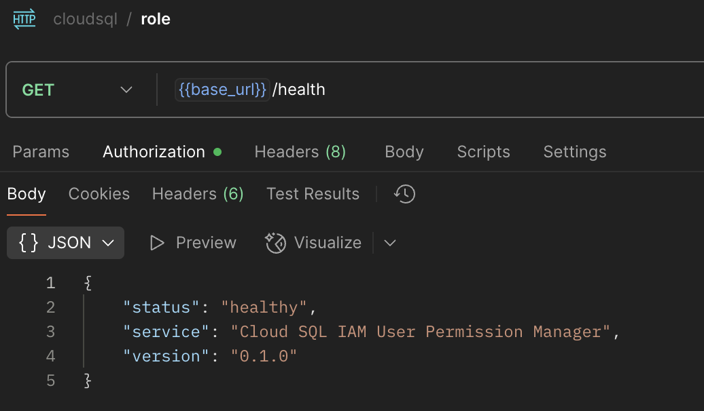

# Cloud SQL PostgreSQL Manager

A comprehensive solution for automating Google Cloud SQL PostgreSQL database management and IAM user permissions across multiple databases in an organization.

## 🎬 Application Demo

This application provides a complete REST API for managing PostgreSQL databases, schemas, roles, and IAM users. Below you'll find screenshots demonstrating the key features:

### Quick Overview
- **Health Monitoring**: Real-time service and database health checks
- **Schema Management**: Create and manage database schemas with proper ownership
- **Role Management**: Initialize, assign, and revoke PostgreSQL roles
- **IAM Integration**: Seamless Google Cloud IAM user management
- **Database Operations**: List schemas, tables, and perform health checks

*Scroll down to see detailed screenshots for each feature!*

## 📚 Documentation Overview

This project contains comprehensive documentation for the Cloud SQL PostgreSQL Manager, a modular FastAPI service for managing PostgreSQL databases, schemas, roles, and IAM user permissions in Google Cloud SQL.

## 📖 Documentation Structure

### 🏗️ Architecture Documentation
- **[md/ARCHITECTURE_OVERVIEW.md](./md/ARCHITECTURE_OVERVIEW.md)** - High-level system architecture and design principles
- **[md/SERVICES.md](./md/SERVICES.md)** - Detailed documentation of all services and their responsibilities
- **[md/COMPONENTS.md](./md/COMPONENTS.md)** - Component system documentation and reusable business logic
- **[md/PLUGINS.md](./md/PLUGINS.md)** - Plugin system documentation for extensible role management

### 🌐 API Documentation
- **[md/API.md](./md/API.md)** - Complete API endpoint documentation with examples
- **[md/test_endpoints.json](./md/test_endpoints.json)** - Test endpoints and sample requests

### 🧪 Testing Documentation
- **[md/ROLE_TESTING.md](./md/ROLE_TESTING.md)** - Comprehensive guide for testing standard roles and permissions
- **[md/QUICK_TEST_GUIDE.md](./md/QUICK_TEST_GUIDE.md)** - Quick 5-minute testing guide for role validation
- **[md/role_test_scripts.sql](./md/role_test_scripts.sql)** - Automated SQL test scripts

### 🚀 Deployment Documentation
- **[md/DEPLOYMENT.md](./md/DEPLOYMENT.md)** - Comprehensive deployment guide for various environments

## 🎯 Quick Start

### 1. Architecture Understanding
Start with [md/ARCHITECTURE_OVERVIEW.md](./md/ARCHITECTURE_OVERVIEW.md) to understand the system design and components.

### 2. Service Details
Read [md/SERVICES.md](./md/SERVICES.md) to understand each service's responsibilities and interactions.

### 3. API Usage
Check [md/API.md](./md/API.md) for endpoint documentation and examples.

### 4. Deployment
Follow [md/DEPLOYMENT.md](./md/DEPLOYMENT.md) for deployment instructions.

## 🏗️ System Architecture

The system follows a **modular microservices architecture** with clear separation of concerns:

```
┌─────────────────┐    ┌─────────────────┐    ┌─────────────────┐
│   API Layer     │    │  Service Layer  │    │ Component Layer │
│                 │    │                 │    │                 │
│ • Health Router │    │ • ConnectionMgr │    │ • Validation    │
│ • Database Router│    │ • SchemaMgr    │    │ • ErrorHandler  │
│ • Schema Router │    │ • RoleMgr       │    │ • ServiceOps    │
│ • Role Router   │    │ • UserMgr       │    │ • DatabaseOps   │
└─────────────────┘    └─────────────────┘    └─────────────────┘
```

## 🔧 Key Features

### Database Management
- **Schema Operations**: Create, list, and manage database schemas
- **Table Management**: List tables with metadata and statistics
- **Health Monitoring**: Comprehensive database health checks
- **Connection Pooling**: High-performance connection management

### Role-Based Access Control
- **Plugin System**: Extensible role definitions with versioning
- **Permission Levels**: `readonly`, `readwrite`, `admin` with granular control
- **IAM Integration**: Seamless Google Cloud IAM user management
- **Role Registry**: Firestore-based role tracking and history

### Security & Validation
- **Input Validation**: Comprehensive request validation
- **IAM Validation**: Service account and permission verification
- **SQL Injection Protection**: Parameterized queries and sanitization
- **Error Handling**: Secure error responses without information leakage

## 📋 Service Overview

| Service | Purpose | Key Features |
|---------|---------|--------------|
| **ConnectionManager** | Database connection pooling | High-performance, automatic recovery |
| **SchemaManager** | Schema and table operations | Creation, listing, ownership management |
| **RoleManager** | Role initialization and management | Plugin system, versioning, Firestore integration |
| **UserManager** | IAM user operations | Validation, normalization, permission checks |
| **RolePermissionManager** | Role assignments | User-role mapping, permission management |
| **HealthManager** | System monitoring | Health checks, performance metrics |

## 🔌 Plugin System

The system includes an extensible plugin architecture for role management:

- **StandardRolePlugin**: Built-in role definitions
- **CustomRolePlugin**: Custom role implementations
- **PluginRegistry**: Plugin management and loading
- **Version Control**: Role versioning and updates

## 🌐 API Endpoints & Screenshots

### Health Monitoring
- `GET /health` - Service health check



### Database Management
- `POST /database/schemas` - List database schemas
- `POST /database/tables` - List schema tables  
- `POST /database/health` - Database health check


### Schema Management
- `POST /schemas/create` - Create database schema


### Role Management
- `POST /roles/initialize` - Initialize roles
- `POST /roles/assign` - Assign role to user
- `POST /roles/revoke` - Revoke role from user
- `POST /roles/list` - List available roles


### IAM User Management
- `POST /database/postgres-inheritance/grant` - Grant IAM user to postgres
- `POST /database/postgres-inheritance/revoke` - Revoke IAM user from postgres


## 📊 PostgreSQL Results

### Database Schema Overview


### PostgreSQL Command Line Results


## 🚀 Deployment Options

### Local Development
```bash
cd postgres-manager
uvicorn app.main:app --reload --host 0.0.0.0 --port 8080
```

### Docker
```bash
cd postgres-manager
docker build -t cloudsql-postgres-manager .
docker run -p 8080:8080 cloudsql-postgres-manager
```

### Google Cloud Run
```bash
gcloud run deploy cloudsql-postgres-manager \
  --image gcr.io/PROJECT_ID/cloudsql-postgres-manager \
  --platform managed \
  --region europe-west1
```


## 🧪 Testing

For comprehensive testing documentation, see:
- **[tests/README.md](./tests/README.md)** - Complete test suite documentation

### Role Testing
For comprehensive role testing, see the testing documentation:
- **[md/ROLE_TESTING.md](./md/ROLE_TESTING.md)** - Complete testing guide
- **[md/QUICK_TEST_GUIDE.md](./md/QUICK_TEST_GUIDE.md)** - Quick testing guide
- **[md/role_test_scripts.sql](./md/role_test_scripts.sql)** - Automated test scripts

## 📊 Monitoring

### Health Checks
- **Service Health**: `GET /health`
- **Database Health**: `POST /database/health`

### Metrics
- Request processing time
- Database connection metrics
- Error rates by endpoint
- Role operation success rates

### Logging
Structured JSON logging with correlation IDs and performance metrics.

## 🔒 Security

### Authentication
- Google Cloud IAM integration
- Service account validation
- Permission verification

### Data Protection
- Secret Manager for credentials
- Parameterized queries
- Input validation and sanitization

### Error Security
- Sanitized error messages
- No sensitive data in logs
- Structured error responses

## 📈 Performance

### Connection Pooling
- High-performance connection management
- Configurable pool sizes
- Automatic connection recovery

### Scalability
- Modular design for independent scaling
- Plugin-based extensibility
- Component reusability

## 📁 Project Structure

```
cloudsql-postgres-manager/
├── postgres-manager/           # FastAPI application
│   ├── app/
│   │   ├── main.py            # Main application code
│   │   ├── models.py          # Pydantic models
│   │   ├── services/          # Business logic
│   │   ├── components/        # Reusable components
│   │   ├── routers/           # API endpoints
│   │   ├── plugins/           # Plugin system
│   │   └── utils/             # Utilities
│   ├── requirements.txt       # Python dependencies
│   └── Dockerfile            # Container configuration
├── md/                        # Documentation
│   ├── README.md             # This file
│   ├── API.md                # API documentation
│   ├── SERVICES.md           # Service documentation
│   ├── ROLE_TESTING.md       # Role testing guide
│   └── ...                   # Other documentation
└── README.md                 # This file
```

## 🤝 Contributing

1. Read the architecture documentation
2. Understand the service responsibilities
3. Follow the component patterns
4. Add comprehensive tests
5. Update documentation

## 📞 Support

- **Documentation**: [md/](./md/) directory
- **API Docs**: http://localhost:8080/docs
- **Issues**: GitHub Issues


---

## 🔄 Documentation Updates

This documentation is maintained alongside the codebase. When making changes:

1. Update relevant documentation files
2. Ensure examples are current
3. Test all code examples
4. Update version numbers
5. Review for accuracy and completeness

For questions or suggestions about the documentation, please open an issue or submit a pull request.