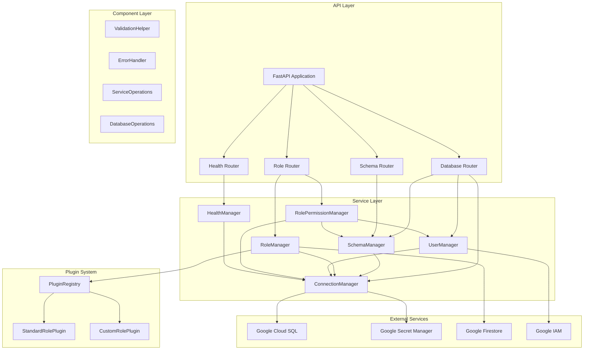

# Architecture Overview

## 🏗️ System Architecture

The Cloud SQL PostgreSQL Manager follows a **modular microservices architecture** designed for scalability, maintainability, and extensibility.

## 📊 High-Level Architecture



## 🎯 Design Principles

### 1. **Separation of Concerns**
Each service has a single, well-defined responsibility:
- **ConnectionManager**: Database connection management
- **SchemaManager**: Schema operations
- **RoleManager**: Role lifecycle management
- **UserManager**: IAM user operations
- **RolePermissionManager**: Permission assignments
- **HealthManager**: System monitoring

### 2. **Dependency Injection**
Services receive their dependencies through constructors, enabling:
- Easy testing with mocks
- Flexible configuration
- Loose coupling between components

### 3. **Plugin Architecture**
Extensible role system allows:
- Custom role definitions
- Version management
- Hot-swappable plugins

### 4. **Error Handling**
Centralized error handling with:
- Consistent error responses
- Detailed logging
- Security-conscious error messages

## 🔄 Data Flow

### 1. **Request Processing**
```
Client Request → Router → Service → Component → Database
                ↓
            Error Handler ← Validation Helper
```

### 2. **Role Initialization**
```
RoleManager → PluginRegistry → RoleDefinition → SQL Execution
     ↓
FirestoreRegistry ← Database Operations
```

### 3. **Schema Management**
```
SchemaManager → ConnectionManager → PostgreSQL
     ↓
ValidationHelper → ErrorHandler
```

## 🛡️ Security Architecture

### 1. **Authentication & Authorization**
- Google Cloud IAM integration
- Service account validation
- Permission verification

### 2. **Data Protection**
- Secret Manager for credentials
- Parameterized queries
- Input validation and sanitization

### 3. **Error Security**
- Sanitized error messages
- No sensitive data in logs
- Structured error responses

## 📈 Scalability Features

### 1. **Connection Pooling**
- High-performance connection management
- Configurable pool sizes
- Automatic connection recovery

### 2. **Modular Design**
- Independent service scaling
- Plugin-based extensibility
- Component reusability

### 3. **Monitoring & Observability**
- Structured logging
- Health checks
- Performance metrics

## 🔧 Configuration Management

### 1. **Environment-Based Configuration**
- Development, staging, production configs
- Secret management via Google Secret Manager
- Feature flags and toggles

### 2. **Service Configuration**
- Database connection settings
- Plugin configurations
- Logging levels

## 🧪 Testing Strategy

### 1. **Unit Tests**
- Service-level testing
- Component testing
- Mock-based isolation

### 2. **Integration Tests**
- End-to-end API testing
- Database integration
- External service mocking

### 3. **Validation Tests**
- Configuration validation
- Import testing
- Service initialization

## 📚 Documentation Structure

- **ARCHITECTURE_OVERVIEW.md**: This file - high-level architecture
- **SERVICES.md**: Detailed service documentation
- **COMPONENTS.md**: Component system documentation
- **PLUGINS.md**: Plugin system documentation
- **API.md**: API endpoint documentation
- **DEPLOYMENT.md**: Deployment and configuration guide