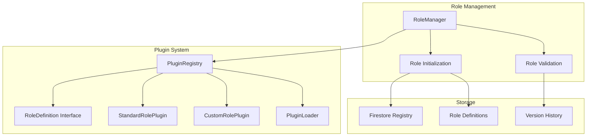

# Plugin System Documentation

## 🔌 Plugin Architecture

The plugin system provides an extensible way to define and manage PostgreSQL roles with versioning, validation, and hot-swappable capabilities.

## 📋 Plugin Overview

| Component | Purpose | Location |
|-----------|---------|----------|
| `PluginRegistry` | Plugin management and loading | `app/plugins/registry.py` |
| `RoleDefinition` | Base role definition interface | `app/plugins/base.py` |
| `StandardRolePlugin` | Built-in role definitions | `app/plugins/standard_roles.py` |
| `CustomRolePlugin` | Custom role implementations | `app/plugins/examples/custom_roles.py` |

## 🏗️ Plugin System Architecture



## 🔧 PluginRegistry

**Purpose**: Central plugin management and loading system.

### Key Features
- Plugin discovery and loading
- Version management
- Hot-swappable plugins
- Plugin validation

### Methods
```python
def register_plugin(plugin)
def load_plugin_from_module(module_path)
def get_all_plugins()
def get_plugin_by_name(name)
def validate_plugin(plugin)
```

### Usage Example
```python
from app.plugins.registry import PluginRegistry

# Initialize registry
registry = PluginRegistry()

# Register standard plugin
from app.plugins.standard_roles import StandardRolePlugin
standard_plugin = StandardRolePlugin()
registry.register_plugin(standard_plugin)

# Load custom plugin
custom_plugin = registry.load_plugin_from_module("app.plugins.examples.custom_roles")
```

## 📝 RoleDefinition Interface

**Purpose**: Base interface for all role definitions.

### Required Attributes
```python
class RoleDefinition:
    name: str                    # Role name
    version: str                 # Version number
    checksum: str               # Content checksum
    sql_commands: List[str]     # SQL commands to execute
    inherits: List[str]         # Roles to inherit from
    native_roles: List[str]     # Native PostgreSQL roles
    created_at: datetime        # Creation timestamp
    status: str                 # Role status
```

### Methods
```python
def get_role_definitions(database_name, schema_name)
def validate_role_definition()
def calculate_checksum()
def to_dict()
```

## 🏢 StandardRolePlugin

**Purpose**: Built-in role definitions for common use cases.

### Role Types
- **Reader Roles**: `reader_{schema_name}`
- **Writer Roles**: `writer_{schema_name}`
- **Admin Roles**: `admin_{schema_name}`
- **App Roles**: `app_{schema_name}`

### Permission Levels
- **Readonly**: SELECT permissions only
- **Readwrite**: SELECT, INSERT, UPDATE, DELETE
- **Admin**: All permissions + schema management

### Example Role Definition
```python
def get_role_definitions(self, database_name, schema_name):
    return [
        RoleDefinition(
            name=f"reader_{schema_name}",
            version="1.0.0",
            checksum="abc123...",
            sql_commands=[
                f'CREATE ROLE "reader_{schema_name}"',
                f'GRANT USAGE ON SCHEMA "{schema_name}" TO "reader_{schema_name}"',
                f'GRANT SELECT ON ALL TABLES IN SCHEMA "{schema_name}" TO "reader_{schema_name}"'
            ],
            inherits=["readonly"],
            native_roles=["readonly"],
            created_at=datetime.now(),
            status="active"
        )
    ]
```

## 🎨 CustomRolePlugin

**Purpose**: Custom role implementations for specific business needs.

### Creating Custom Plugins
```python
from app.plugins.base import RoleDefinition, RolePlugin

class CustomRolePlugin(RolePlugin):
    def get_role_definitions(self, database_name, schema_name):
        return [
            RoleDefinition(
                name=f"analyst_{schema_name}",
                version="1.0.0",
                checksum=self._calculate_checksum(),
                sql_commands=[
                    f'CREATE ROLE "analyst_{schema_name}"',
                    f'GRANT USAGE ON SCHEMA "{schema_name}" TO "analyst_{schema_name}"',
                    f'GRANT SELECT ON ALL TABLES IN SCHEMA "{schema_name}" TO "analyst_{schema_name}"',
                    f'GRANT EXECUTE ON ALL FUNCTIONS IN SCHEMA "{schema_name}" TO "analyst_{schema_name}"'
                ],
                inherits=["reader"],
                native_roles=["reader"],
                created_at=datetime.now(),
                status="active"
            )
        ]
```

## 🔄 Plugin Lifecycle

### 1. **Plugin Discovery**
```python
# Load plugins from module paths
plugin_paths = [
    "app.plugins.standard_roles",
    "app.plugins.examples.custom_roles"
]

for path in plugin_paths:
    plugin = registry.load_plugin_from_module(path)
    if plugin:
        registry.register_plugin(plugin)
```

### 2. **Role Definition Generation**
```python
# Get role definitions for specific schema
role_definitions = []
for plugin in registry.get_all_plugins().values():
    if hasattr(plugin, 'get_role_definitions'):
        plugin_roles = plugin.get_role_definitions(database_name, schema_name)
        role_definitions.extend(plugin_roles)
```

### 3. **Role Validation**
```python
# Validate role definitions
for role_def in role_definitions:
    validation_result = RoleValidator.validate_role_definition(role_def)
    if not validation_result["valid"]:
        logger.warning(f"Role {role_def.name} failed validation: {validation_result['errors']}")
```

### 4. **Role Execution**
```python
# Execute role creation
for role_def in role_definitions:
    success = execute_sql_commands(connection, role_def.sql_commands)
    if success:
        logger.info(f"Successfully created role {role_def.name}")
```

## 🗄️ Firestore Integration

### Role Registry Structure
```json
{
  "project_id": "my-project",
  "instance_name": "my-instance",
  "database_name": "my-database",
  "roles_initialized": true,
  "last_updated": "2024-01-01T00:00:00Z",
  "plugin_roles": {
    "reader_app_schema": {
      "version": "1.0.0",
      "checksum": "abc123...",
      "sql_commands": [...],
      "inherits": ["readonly"],
      "native_roles": ["readonly"],
      "created_at": "2024-01-01T00:00:00Z",
      "status": "active"
    }
  }
}
```

### Registry Operations
```python
# Save role registry
firestore_manager.save_role_registry(
    project_id, instance_name, database_name, registry
)

# Get role registry
registry = firestore_manager.get_role_registry(
    project_id, instance_name, database_name
)

# Update role status
registry.plugin_roles[role_name]["status"] = "updated"
firestore_manager.save_role_registry(project_id, instance_name, database_name, registry)
```

## 🧪 Testing Plugins

### Unit Testing
```python
def test_standard_role_plugin():
    plugin = StandardRolePlugin()
    roles = plugin.get_role_definitions("test_db", "test_schema")
    
    assert len(roles) > 0
    assert all(isinstance(role, RoleDefinition) for role in roles)
    assert all(role.name.endswith("_test_schema") for role in roles)

def test_custom_role_plugin():
    plugin = CustomRolePlugin()
    roles = plugin.get_role_definitions("test_db", "test_schema")
    
    # Test custom role logic
    analyst_roles = [r for r in roles if "analyst" in r.name]
    assert len(analyst_roles) > 0
```

### Integration Testing
```python
def test_plugin_registry():
    registry = PluginRegistry()
    
    # Register plugins
    standard_plugin = StandardRolePlugin()
    registry.register_plugin(standard_plugin)
    
    # Test plugin retrieval
    plugins = registry.get_all_plugins()
    assert "StandardRolePlugin" in plugins
    
    # Test role definition generation
    roles = []
    for plugin in plugins.values():
        roles.extend(plugin.get_role_definitions("test_db", "test_schema"))
    
    assert len(roles) > 0
```

## 📊 Plugin Metrics

### Registry Metrics
- Plugin loading success rate
- Plugin validation success rate
- Role definition generation time

### Role Metrics
- Role creation success rate
- Role update frequency
- Role validation errors

### Firestore Metrics
- Registry save success rate
- Registry retrieval time
- Role status update frequency

## 🔧 Configuration

### Plugin Configuration
```bash
# Plugin settings
PLUGIN_AUTO_LOAD=true
PLUGIN_VALIDATION_STRICT=true
PLUGIN_CACHE_ENABLED=true

# Firestore settings
FIRESTORE_PROJECT_ID=your-project
FIRESTORE_COLLECTION=role_registries
FIRESTORE_CACHE_TTL=3600
```

### Plugin Paths
```python
# Configure plugin paths
PLUGIN_PATHS = [
    "app.plugins.standard_roles",
    "app.plugins.examples.custom_roles",
    "custom.plugins.business_roles"
]
```

## 🚀 Best Practices

### 1. **Plugin Development**
- Follow the RoleDefinition interface
- Implement proper validation
- Use semantic versioning
- Include comprehensive tests

### 2. **Role Definition**
- Use descriptive role names
- Include proper SQL comments
- Handle edge cases gracefully
- Validate SQL syntax

### 3. **Registry Management**
- Register plugins early in application lifecycle
- Validate plugins before registration
- Handle plugin loading errors gracefully
- Maintain plugin version history

### 4. **Testing**
- Test plugins in isolation
- Test plugin interactions
- Test role definition validation
- Test Firestore integration

## 🔄 Migration and Versioning

### Role Versioning
```python
# Version comparison
def compare_versions(version1, version2):
    v1_parts = [int(x) for x in version1.split('.')]
    v2_parts = [int(x) for x in version2.split('.')]
    return (v1_parts > v2_parts) - (v1_parts < v2_parts)

# Role update logic
if compare_versions(new_version, current_version) > 0:
    # Update role
    update_role(role_definition)
```

### Plugin Migration
```python
# Plugin compatibility check
def is_plugin_compatible(plugin, target_version):
    return plugin.version >= target_version

# Migration strategy
if not is_plugin_compatible(plugin, required_version):
    # Load compatible version or fallback
    plugin = load_compatible_plugin(plugin_name, required_version)
```